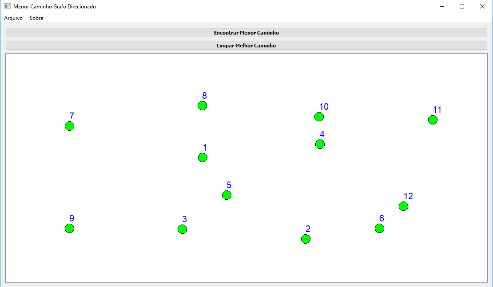
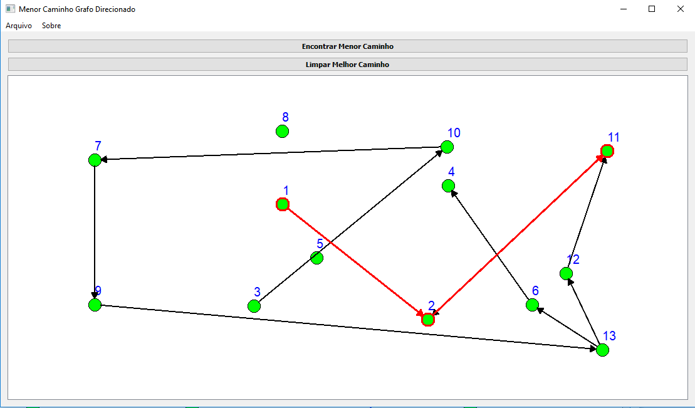
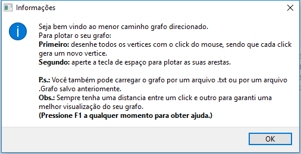

# ToolBestWayGraph

This tool has as main purpose the plot of directed graphs and the demonstration of the smallest path in a visual way to facilitate the learning of the students. The student has the option of creating the graph with the click of the mouse or importing it from a text file.
It is then possible to create or modify the edges and request the smallest path between any two vertices.
The result will be plotted in the graph itself, according to the images. At the end of this process, the student can save everything to a system extension file or export it to a text file.
This application employed several graphical techniques for better user experience and was developed using C ++ and Qt.

  

  

  

